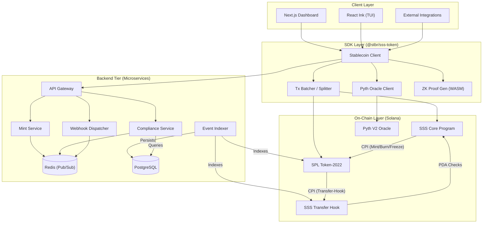

<div align="center">

# Solana Stablecoin Standard

**Enterprise-Ready Toolkit for On-Chain Fiat and Compliant Tokens on Solana via Token-2022**

_Modular Architecture · 3 Compliance Tiers · Privacy Modes · API & Webhooks · Full TUI Dashboard_

[](https://github.com/solanabr/solana-stablecoin-standard/actions/workflows/ci.yml)
[](LICENSE)
[](https://www.anchor-lang.com/)
[](https://spl.solana.com/token-2022)

</div>

---

## 📌 Overview

The Solana Stablecoin Standard is an opinionated, production-grade framework designed to simplify the issuance of fiat-pegged or fiat-backed tokens on the Solana network. Rather than piecing together individual Token-2022 extensions, issuers can select from three predefined tiers (SSS-1, SSS-2, and SSS-3) that bundle the exact capabilities needed for their regulatory and operational requirements.

Whether you're building an internal DAO settlement token, a fully regulated USDC-like asset with mandatory denylists, or exploring zero-knowledge confidential transfers, this toolkit provides the smart contracts, SDKs, backend services, and interactive CLI dashboards to manage the entire token lifecycle.

---

## 🏗 System Architecture

The project is structured in three composable layers to ensure maximum flexibility while enforcing secure defaults.



---

## 🎛 The Three Tiers

| Capability Snapshot            | Tier 1 (Utility) | Tier 2 (Regulated) | Tier 3 (Private) |
| :----------------------------- | :--------------: | :----------------: | :--------------: |
| **Core Lifecycle (Mint/Burn)** |        ✅        |         ✅         |        ✅        |
| **Account Freeze/Thaw**        |        ✅        |         ✅         |        ✅        |
| **Global Emergency Pause**     |        ✅        |         ✅         |        ✅        |
| **Supply Caps & Oracle Locks** |        ✅        |         ✅         |        ✅        |
| **Permanent Delegate (Seize)** |        ✅        |         ✅         |        ✅        |
| **Denylist (Transfer Hooks)**  |        -         |         ✅         |        -         |
| **Default Frozen Accounts**    |        -         |         ✅         |        -         |
| **Confidential ZK Transfers**  |        -         |         -          |        ✅        |
| **Auditor Keys**               |        -         |         -          |        ✅        |
| _Target Audience_              | _DAO Treasuries_ | _Fiat Stablecoins_ |   _Dark Pools_   |

---

## 🚀 Quick Setup Guide

### Dependencies

Make sure your environment has:

- **Rust** >= 1.75
- **Solana CLI** >= 1.18
- **Anchor Framework** >= 0.32
- **Node.js** >= 20 (with `pnpm`)

### Installation & Build

```bash
git clone https://github.com/solanabr/solana-stablecoin-standard.git
cd solana-stablecoin-standard
pnpm install

# Build the entire workspace (Powered by Turbo)
pnpm build

# Run targeted tests
pnpm test:programs    # Integration coverage (sss-programs)
pnpm test:sdk         # Typescript SDK coverage
```

---

## 💻 Working with the TypeScript SDK

The `@stbr/sss-token` SDK is built with strong typing, tree-shakability, and an intuitive client.

- **Automatic Transaction Splitting**: Handles large instruction sets by splitting them into safe-sized transactions.
- **Solscan Integration**: Returns transaction signatures with direct Solscan Devnet links.

```typescript
import { SSS, SSS_TIERS } from '@stbr/sss-token';
import { AnchorProvider } from '@coral-xyz/anchor';

const provider = AnchorProvider.env();

// 1. Deploy a heavily-regulated Tier 2 token
const stablecoin = await SSS.create(provider, {
  preset: SSS_TIERS.SSS_2,
  name: 'Global Euro Dollar',
  symbol: 'GEUR',
  decimals: 6,
  supplyCap: 1_000_000_000_000n,
});

// 2. Manage Roles (Supports Multi-granting with auto-splitting)
await stablecoin.roles.grant(treasuryWallet.publicKey, ['minter', 'freezer']);

// 3. Issue and Burn
await stablecoin.mint({ recipient: targetWallet, amount: 500_000_000n });
```

---

## 🎛 CLI & Interactive Dashboard

The terminal application is powered by React Ink, giving operators an advanced dashboard with tabs and real-time operations.

- **`[f]` Relationship Cycle**: Filter by Managed, All, Authority, or Roles.
- **`[/]` Regex Search**: Real-time regex matching for token names and symbols.
- **`[n]/[p]` Pagination**: Efficiently browse large catalogs of tokens.

```bash
# Launch the interactive terminal UI (TUI)
pnpm start --filter @stbr/sss-cli
```

---

## 🔌 Backend Integrations

The backend is a modern microservices ecosystem designed for scale and modularity:

- **Mint Service**: Fiat-to-stablecoin lifecycle coordination.
- **Compliance Service**: Blacklist and sanctions management.
- **Event Listener**: Real-time on-chain indexing.
- **Webhook Service**: Reliable notifications with queue management.
- **API Gateway**: Unified REST/WebSocket entry point.

```bash
# Start the entire stack (Postgres + Redis + Microservices)
docker compose up -d
```

---

## 🌐 Deployment to Devnet

The core programs are already deployed and rigorously verified on the Solana Devnet. You can review the raw transaction receipts spanning all three tiers in [`deployments/devnet-proof.json`](deployments/devnet-proof.json).

| Smart Contract      | Address on Devnet                              |
| :------------------ | :--------------------------------------------- |
| `sss-core`          | `SSSCFmmtaU1oToJ9eMqzTtPbK9EAyoXdivUG4irBHVP`  |
| `sss-transfer-hook` | `HookFvKFaoF9KL8TUXUnQK5r2mJoMYdBENu549seRyXW` |

---

## 🧪 Test Coverage

We maintain absolute strictness regarding correct execution. The repository houses **243 fully passing tests** across multiple verification layers:

- **96 Anchor Integration Tests**: End-to-end flows asserting role escalations, hook boundaries, and token lifecycle integrity.
- **141 SDK Unit Tests**: Exhaustive coverage for PDA math, strict type safety, transaction building, and cryptographic primitives.
- **6 Rust Unit Tests**: Critical low-level logic verification for supply caps and mathematical state transitions.
- **Trident Fuzz Tests**: High-entropy property-based testing to stress-test program boundaries against malicious inputs.
- **Verification Scripts**: Specialized node scripts for runtime health checks and deployment validation.

All suites are currently **PASSING** in the CI pipeline.

---

## 📁 Directory Layout

```text
├── sss-programs/
│   ├── sss-core/               # Primary stablecoin state and authority
│   └── sss-transfer-hook/      # Token-2022 Transfer Hook policy manager
├── solana-stablecoin-sdk/      # TypeScript SDK (@stbr/sss-token)
├── solana-stablecoin-cli/      # React Ink CLI + Dashboard
├── solana-stablecoin-backend/  # Express REST API, Websockets & Webhooks
├── solana-stablecoin-frontend/ # Next.js Web Dashboard
├── tests/                      # Anchor integration suite
├── trident-tests/              # Rust property-based fuzz tests
├── deployments/                # Devnet proofs
└── docs/                       # Architectural reference
```

---

## 📚 Docs Index

For deep-dive documentation, consult the files in `/docs`:

- **[Architecture Deep-Dive](docs/ARCHITECTURE.md)** (State flows and program relationships)
- **[SDK Documentation](docs/SDK.md)** (Typescript API references and types)
- **[CLI Runbook](docs/CLI.md)** (Full list of subcommands)
- **[Backend API Spec](docs/API.md)** (REST boundaries and error codes)
- **[Tier Specs](docs/)** (Individual breakdowns for `SSS-1.md`, `SSS-2.md`, and `SSS-3.md`)
- **[Operator Guidelines](docs/OPERATIONS.md)** (Emergency response procedures)
- **[Security Posture](docs/SECURITY.md)** (Threat modeling)

---

## 🛡️ Security & Architecture Notes

1. **Tier 2 Seizure Operations:** SSS-2 stablecoins utilize Token-2022 transfer hooks for compliance. The `seize` instruction is fully compatible with these hooks; callers simply need to provide the required auxiliary accounts (blacklist PDAs and hook program) as `remaining_accounts`. This enables the `sss-core` program to correctly pass validation through the hook during the CPI.
2. **Admin Role Redundancy:** Built-in safeguards prevent the final active administrator from revoking their own role, ensuring the contract can always be managed. For production deployments, we strongly recommend assigning the `Admin` role to a multisig (e.g., Squads) to manage multi-party revocations and eliminate single-point-of-failure risks.
3. **Emergency Role Flexibility:** Role grants and revocations for the `Admin` role remain active even when the stablecoin is globally paused. This ensures that in a security incident, the treasury can still rotate administrator keys or revoke compromised identities without needing to unpause token operations first.

---

## 🤝 Contributing

We welcome community extensions and patches.

1. Fork the repository
2. Create your isolated feature branch (`git checkout -b feature/your-feature`)
3. Validate your changes against the entire suite (`anchor test && pnpm test:sdk && cargo test`)
4. Submit your pull request against `main`

---

## 📄 License

This codebase is distributed under the MIT License. See [LICENSE](LICENSE) for more information.
