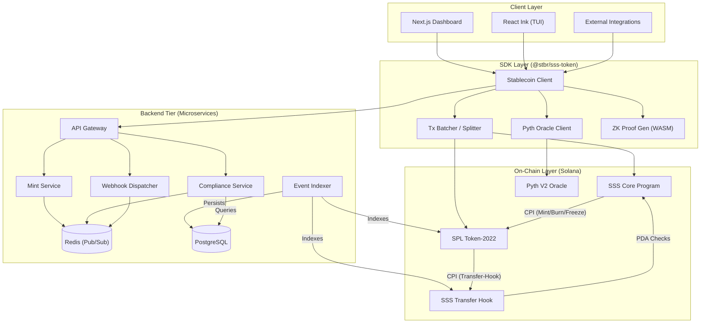

# Solana Stablecoin Standard (SSS)

## Overview

The Solana Stablecoin Standard (SSS) is a comprehensive, production-ready framework for issuing and managing stablecoins on the Solana blockchain. Built on top of the Token-2022 (Token Extensions) program, SSS provides institutional-grade controls, compliance features, and privacy options through a unified interface.

## Quick Start

1. **Clone the repository:**
   ```bash
   git clone https://github.com/your-repo/solana-stablecoin-standard.git
   cd solana-stablecoin-standard
   ```
2. **Install dependencies:**
   ```bash
   pnpm install
   ```
3. **Build the entire workspace (Powered by Turbo):**
   ```bash
   pnpm build
   ```
4. **Run the local frontend:**
   ```bash
   pnpm dev --filter frontend
   ```
5. **Run the backend services (Docker):**
   ```bash
   docker compose up -d
   ```
6. **Use the CLI to manage stablecoins:**
   ```bash
   pnpm start --filter @stbr/sss-cli
   ```

## Preset Comparison

| Feature                    | SSS-1 (Minimal) | SSS-2 (Compliant)     | SSS-3 (Private)           |
| -------------------------- | --------------- | --------------------- | ------------------------- |
| Minting/Burning            | Yes             | Yes                   | Yes                       |
| Role Management            | Yes             | Yes                   | Yes                       |
| Freeze/Thaw                | Yes             | Yes                   | Yes                       |
| Transfer Hook Blacklist    | No              | Yes                   | No                        |
| Permanent Delegate (Seize) | No              | Yes                   | Yes                       |
| Confidential Transfers     | No              | No                    | Yes                       |
| Use Case                   | Simple payments | Regulated stablecoins | Institutional/Private txs |

## Standard Specifications

- [SSS-1 (Minimal)](SSS-1.md) - Baseline stablecoin configuration.
- [SSS-2 (Compliant)](SSS-2.md) - On-chain compliance and administrative controls.
- [SSS-3 (Private)](SSS-3.md) - Experimental Zero-Knowledge confidential transfers.

## Architecture Diagram


